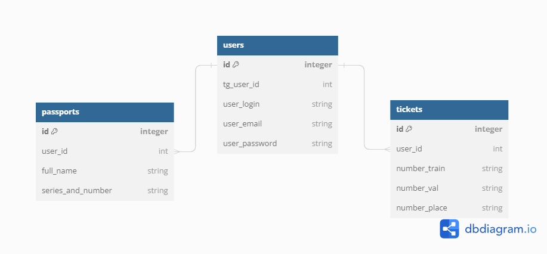

# Бейджи статус пайплайна CI/CD

# Python/JS version
 

# ER диаграмма БД:

# Клонирование репозитория
git clone https://github.com/scolopendra2/dgtu_bot

# Установка и запуск виртуального окружения
python -m venv venv

venv/Scripts/activate

# Установка зависимостей
pip install -r requirements/prod.txt

# Подстановка секретных переменных в окружение
BOT_TOKEN - токен вашего бота
POSTGRES_DB - название базы данных
POSTGRES_USER - имя пользователя
POSTGRES_PASSWORD - пароль
POSTGRES_HOST - хост

# Запуск бота
python app.py